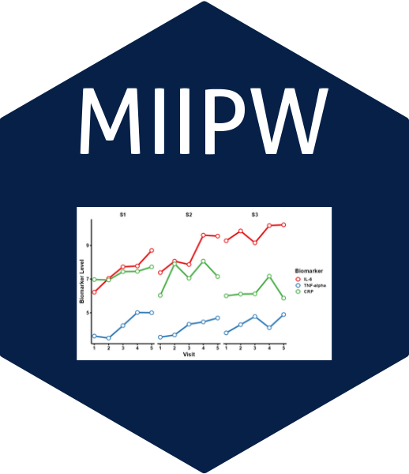

# MIIPW: GEE with Missing Data Using Mean Score, IPW, and Multiple Imputation


<!-- badges: start -->

[](https://www.gnu.org/licenses/gpl-3.0.html)
[](https://CRAN.R-project.org/package=MIIPW)
[](https://lifecycle.r-lib.org/articles/stages.html#experimental)

<!-- badges: end -->

<br/>

> **MIIPW** is an R package for fitting Generalized Estimating Equations (GEE) when data is missing at random (MAR), using a combination of **Mean Score (MS)**, **Inverse Probability Weighting (IPW)**, and **Multiple Imputation (MI)** techniques.

---

## ✨ Features

The MIIPW package supports robust marginal modeling with missing outcome and covariate data by integrating:

- 📌 **Mean Score Approach** for consistent estimation under missingness
- 🧮 **IPW Estimation** using modeled response or missingness probabilities
- ♻️ **Multiple Imputation (MI)** integration for general missing data structures
- 📈 **Flexible model specification** with various correlation structures
- 📦 Easy interface using `gee()` style model formulas

---

## 🛠 Installation

```r
# Install from CRAN (when available)
install.packages("MIIPW")

# Or install the development version from GitHub:
# install.packages("remotes")
remotes::install_github("kumarbhrigu/MIIPW")
```
